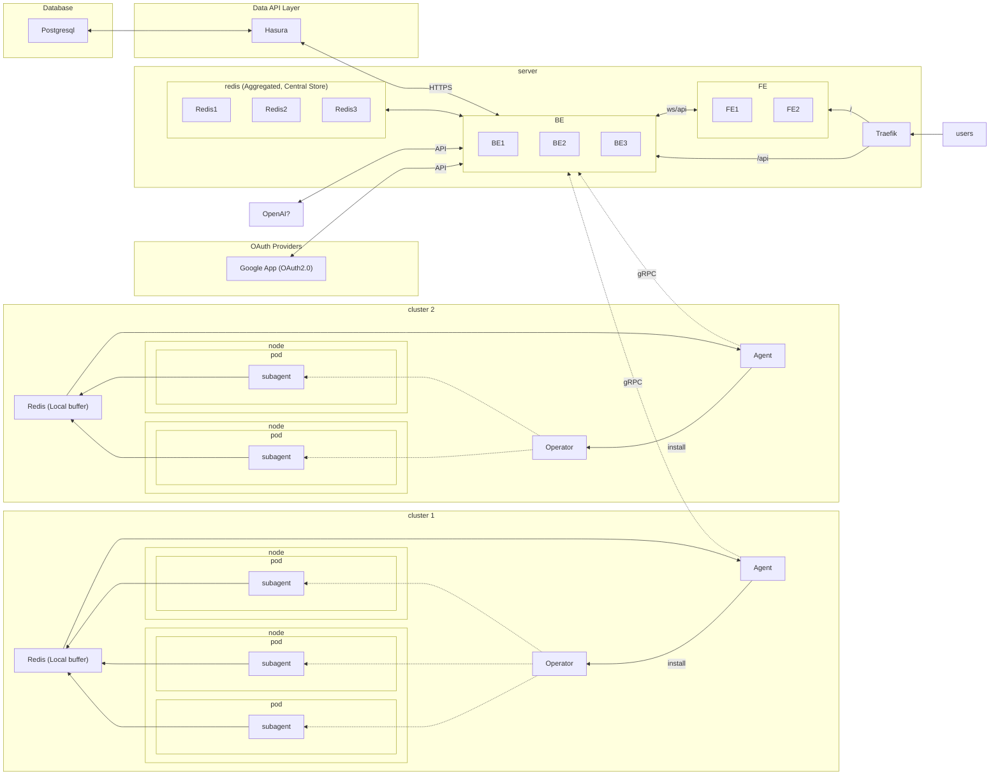

# h-console

### Architecture

```mermaid
graph RL
    subgraph oauthProviders["OAuth Providers"]
        oauthProvidersGoogle["Google App (OAuth2.0)"]
    end

    subgraph server["server"]
        serverProxy["Traefik"]
        
        subgraph serverFE["FE"]
            serverFE1["FE1"]
            serverFE2["FE2"]
        end

        subgraph serverBE["BE"]
            serverBE1["BE1"]
            serverBE2["BE2"]
            serverBE3["BE3"]
        end
        
        subgraph serverRedis["redis (Aggregated, Central Store)"]
            serverRedis1["Redis1"]
            serverRedis2["Redis2"]
            serverRedis3["Redis3"]
        end
    end

    subgraph cluster1["cluster 1"]
        cluster1_agent["Agent"]
        cluster1_redis["Redis (Local buffer)"]
        cluster1_operator["Operator"]
        
        subgraph cluster1_node1["node"]
            subgraph cluster1_node1_pod1["pod"]
                cluster1_node1_pod1_subagent1["subagent"]
            end
            subgraph cluster1_node1_pod2["pod"]
                cluster1_node1_pod2_subagent1["subagent"]
            end
        end

        subgraph cluster1_node2["node"]
            subgraph cluster1_node2_pod1["pod"]
                cluster1_node2_pod1_subagent1["subagent"]
            end
        end

        cluster1_operator -.-> cluster1_node1_pod1_subagent1 --> cluster1_redis
        cluster1_operator -.-> cluster1_node1_pod2_subagent1 --> cluster1_redis
        cluster1_operator -.-> cluster1_node2_pod1_subagent1 --> cluster1_redis
        cluster1_redis --> cluster1_agent -.gRPC.-> serverBE
        cluster1_agent --install--> cluster1_operator
    end


    subgraph cluster2["cluster 2"]
        cluster2_agent["Agent"]
        cluster2_redis["Redis (Local buffer)"]
        cluster2_operator["Operator"]
        
        subgraph cluster2_node1["node"]
            subgraph cluster2_node1_pod2["pod"]
                cluster2_node1_pod2_subagent1["subagent"]
            end
        end
        subgraph cluster2_node2["node"]
            subgraph cluster2_node2_pod2["pod"]
                cluster2_node2_pod2_subagent2["subagent"]
            end
        end

        cluster2_operator -.-> cluster2_node1_pod2_subagent1 --> cluster2_redis
        cluster2_operator -.-> cluster2_node2_pod2_subagent2 --> cluster2_redis
        cluster2_redis --> cluster2_agent -.gRPC.-> serverBE
        cluster2_agent --install--> cluster2_operator
    end

    subgraph dataapilayer["Data API Layer"]
        dataapilayerHasura["Hasura"]
    end
    
    subgraph datalayer["Database"]
        datalayerPostgresql["Postgresql"]
    end
    
    users --> serverProxy
    serverProxy --/--> serverFE
    serverProxy --/api--> serverBE
    serverFE <--ws/api--> serverBE
    serverBE <--HTTPS--> dataapilayerHasura
    serverBE <--> serverRedis
    
    dataapilayerHasura <--> datalayerPostgresql

    serverBE <--API--> oauthProvidersGoogle
    serverBE <--API--> OpenAI?
    
```