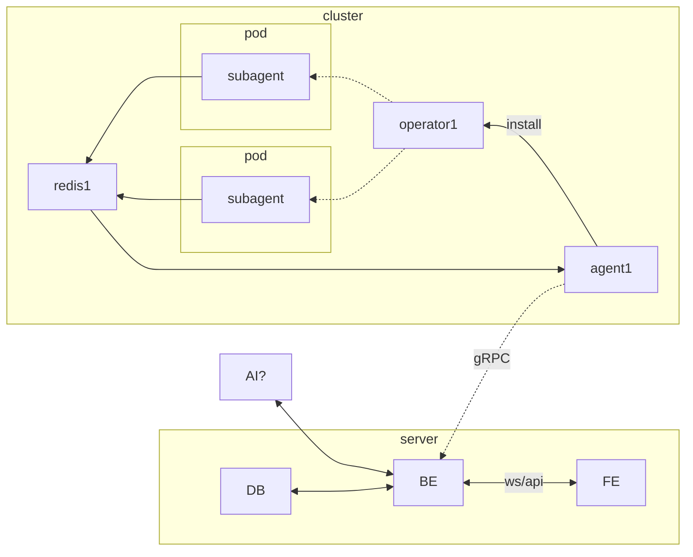

# h-console

```mermaid
graph RL
    subgraph server["server"]
        FE
        BE
        DB
        FE <--ws/api--> BE
        BE <--> DB
    end

    subgraph cluster1["cluster"]
        agent1
        redis1
        operator1
        
        subgraph pod1["pod"]
            subagent1["subagent"]
        end
        subgraph pod2["pod"]
            subagent2["subagent"]
        end

        operator1 -.-> subagent1 --> redis1
        operator1 -.-> subagent2 --> redis1
        redis1 --> agent1 -.gRPC.-> BE
        agent1 --install--> operator1
    end

    BE <--> AI?
```