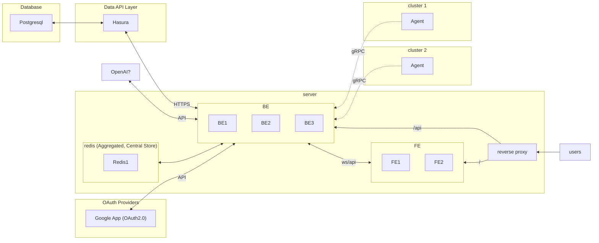

# h-console

### Architecture



### 배포 구조

- 로컬 개발/ 테스트: 각 디렉토리 Makefile 활용
- CI(GHA): Dockerfile, root Makefile 활용
- CD: gitops/ helm, ghcr 또는 oci 활용
    - 작성 중
- /에서 Makefile 로 로컬 도커 이미지 빌드, GHA 빌드 가능
    ```sh
    make build fe # make build fe be agent 로 여러개도 가능
    make deploy fe # make deploy fe be agent -> 동일
    ```